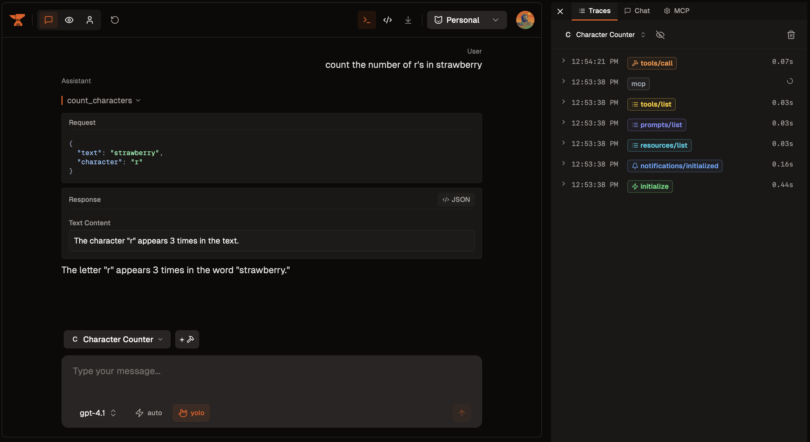

# Python MCP Server with FastMCP

A simple Python MCP server built using the official [MCP Python SDK](https://github.com/modelcontextprotocol/python-sdk) and FastMCP. This example demonstrates how you can host streamable HTTP servers on Smithery, with STDIO support for backwards compatibility.

See the complete guide: https://smithery.ai/docs/migrations/python-custom-container

**[Try it live on Smithery](https://smithery.ai/server/@smithery-ai/cookbook-py-custom-container)**

## Features:

- **CORS**: CORS headers for browser-based MCP clients
- **Smithery Session Configuration**: handles JSON session configuration passed via query parameters ([learn more](https://smithery.ai/docs/build/session-config))
- **Server Transport**: Can run with both STDIO and HTTP transports using `TRANSPORT` env variable

## Prerequisites

- Python 3.12 or higher
- uv package manager
- npx (optional, to launch smithery playground)

## Project Structure

- `src/main.py` - Main FastAPI server with MCP HTTP transport
- `src/middleware.py` - Custom middleware to extract session configuration
- `pyproject.toml` - Python dependencies and project configuration
- `smithery.yaml` - Smithery deployment configuration
- `Dockerfile` - Dockerfile to host server in Smithery
- `uv.lock` - Lockfile for Python dependencies

## Quick Start

1. **Install dependencies:**
   ```bash
   uv sync
   ```
   
2. **Run the development server:**

   **HTTP Mode:**
   ```bash
   TRANSPORT=http uv run python main.py
   ```

   **STDIO Mode (default):**
   ```bash
   uv run python main.py
   ```

3. **Test interactively:**
   Once your server is running in HTTP mode, you can test it interactively using the Smithery playground (set port to match your server):
   ```bash
   npx -y @smithery/cli playground --port 8080
   ```

   

4. **Deploy your own version:**
   To deploy your own MCP server:
   - Connect your repository at [https://smithery.ai/new](https://smithery.ai/new)